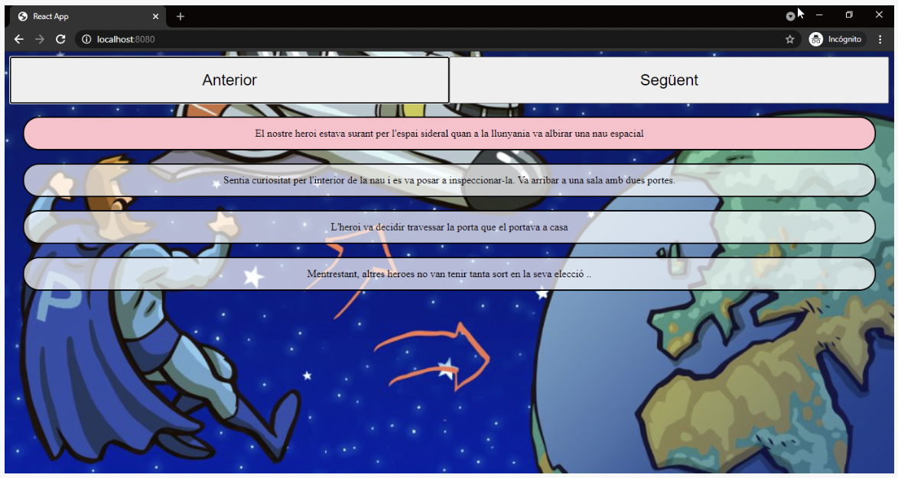
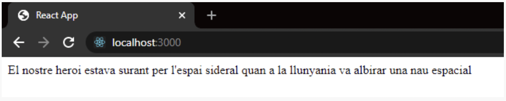
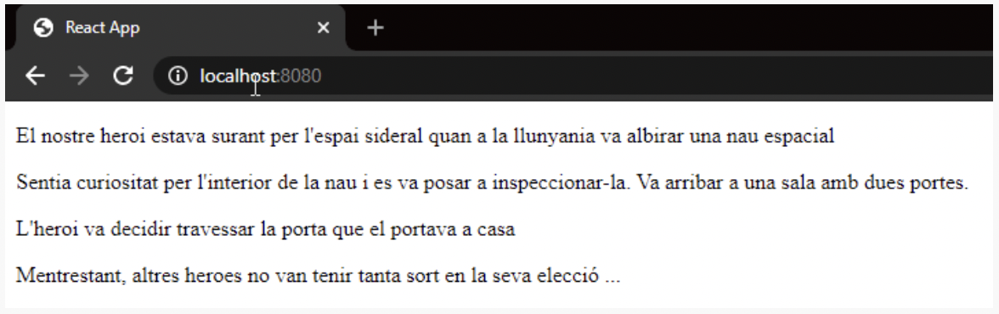
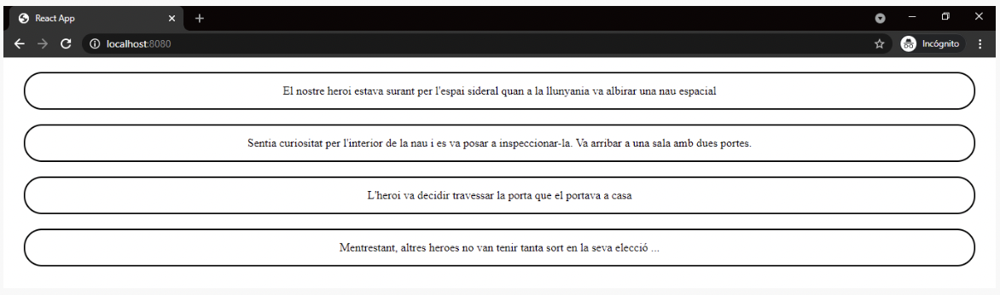
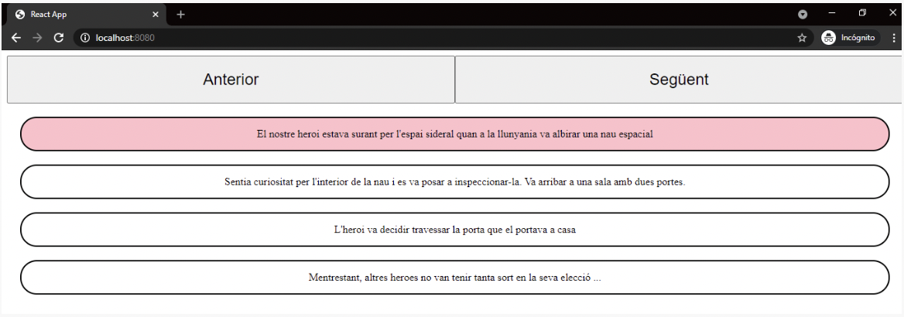

# Descripció

Un/a client/a que té com a producte principal una web de gestió empresarial desenvolupada amb React, ens ha demanat que desenvolupem un tutorial, en el qual mitjançant dos botons els nous usuaris puguin avançar i retrocedir en els consells, modificant-se el text d'ajuda i la imatge de fons.

Com de moment no tenim el material necessari per crear el tutorial, li mostrarem al client/a els següents 4 passos:

# 🌟 Nivell 1
## Exercici 1

Crearem un component que s'encarregarà de renderitzar una frase, i l’importarem i usarem en el component principal App.

Has de dur a terme els següents passos:

1. Crear la carpeta components.

2. Crear la carpeta escena dins de la carpeta components.

3. Dins de la carpeta escena implementarem el primer component. Per a això has de crear el fitxer Escena.js. Aquest primer component només ha de retornar el següent string:

"El nostre heroi estava surant per l'espai sideral quan a la llunyania va albirar una nau espacial"

4. Ja tenim el nostre primer component creat, però encara no es mostrarà la frase. Per a això farem servir el nostre flamant component Escena. En el return del component app has d'utilitzar el component Escena.

El resultat ha de ser:

## Exercici 2

1. Llegirem les dades d'un arxiu JSON o JS, amb els textos de la història en el component App:

[
  "El nostre heroi estava surant per l'espai sideral quan a la llunyania va albirar una nau espacial",
  "Sentia curiositat per l'interior de la nau i es va posar a inspeccionar-la. Va arribar a una sala amb dues portes.",
  "L'heroi va decidir travessar la porta que el portava a casa",
  "Mentrestant, altres herois no van tenir tanta sort en la seva elecció ..."
]
2. S'ha de passar per props cadascun dels textos de la història al component Escena. (El component escena renderitzarà una sola línia de text).

3. Modificarem el component Escena per a mostrar totes les línies de text obtingudes del component pare App mitjançant props.

L’exercici hauria de quedar així:

## Exercici 3

És moment d'aplicar estils al nostre component Escena. Has de maquetar aquest component utilitzant styled-components:

## Exercici 4

Mostrarem totes les línies de l’aplicació, però ressaltarem només una de cada vegada, que anirà canviant a mesura que premem els botons d’avançar o retrocedir:

# 🌟🌟 Nivell 2
## Exercici 5

Seria convenient mostrar a l'usuari/ària una pantalla inicial de benvinguda, que contingui la descripció del projecte i un botó de començar. En aquest exercici has d'usar el renderitzat condicional.

# 🌟🌟🌟 Nivell 3
## Exercici 6

Ja només et falta modificar la imatge de fons segons l'usuari/ària vagi canviant de frase. 

Modificar el fitxer JSON i convertir-lo en un fitxer JS amb un array d'objectes. Cada objecte tindrà dues propietats: txt i img:

- txt serà la propietat que emmagatzemarà el text de l'escena.

- img serà la propietat que emmagatzemarà la imatge de fons que es veurà a la pantalla.

Com en l'array ja tens la frase a mostrar juntament amb la seva imatge, et resultarà senzill dinamitzar l'atribut "src" de la imatge.

